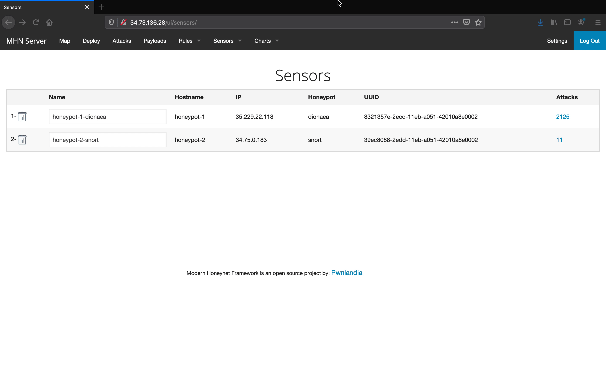

# Honeypot Assignment

**Time spent:** **7** hours spent in total

**Objective:** To set up one or more Honeypots using MHN architechture hosted on the Google Cloud Platform (GCP). For the purpose of this project I set up 3 VM instances, one MHN Admin and two Honeypots (Dionaea and Snort).

### MHN-Admin Deployment (Required)

**Summary:** The VM instance, MHN-Admin, was created to deploy, manage and collect data from the Honeypots. GCP was used to host the virtuals machines and deploy the attacks. The gif below shows the mhn-admin I created on GCP named mhn-admin-bc. 

### Dionaea Honeypot Deployment (Required)

**Summary:** Dionaea is a low-interaction honeypot that traps malware attacks. The gif below gives a glimpse of the attacks captured by my Dionaea honeypot.

### Database Backup (Required) 

**Summary:** The JSON file is an event log of all the attacks targeted at and captured by the honeypots. The date, time, source IP, source port, destination pot, identifier and the targeted honeypot are recorded for each event. See attached sessions.JSON file for the event log of attacks acquired by my Dionaea and Snort honeypots.

### Deploying Additional Honeypot(s) (Optional)

#### Snort Honeypot

**Summary:** Snort is an intrusion detection system (IDS) with the ability to analyze traffic in real time and packet logging.

### Attacks

## Notes

I wasn't sure what to record for the Gifs, I had already set up all the VMs and ran the deploy scripts by the time I went back to reread the instructions on what I needed for the gifs. So I was only able to record me running the deploy script for the Snort honeypot. 
